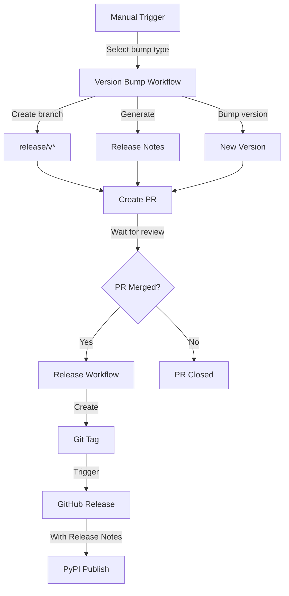

# 🔄 GitHub Workflows

Automated version management, testing, and publishing workflows.

## 🛠️ Development Tools

- 🏗️ **Hatch**: Environment management, building, and publishing
  - 🔖 Version bumping
  - 📦 PyPI publishing
  - ⚙️ Config: `pyproject.toml`

- ⚡ **UV**: Fast Python package installer
  - 🔧 Default installer in Hatch
  - 📝 Config: `installer = "uv"` in `pyproject.toml`

## 🔄 Version Management Flow



## 📝 Release Notes Format

Generated from git history:

```markdown
# 🔖 New Release: v0.2.0
Previous version: v0.1.0

## 📋 Summary

<Placeholder for summary>

## ✨ What's new?

- [Add new feature X](https://github.com/org/repo/commit/a1b2c3d...)
- [Fix critical bug in module Y](https://github.com/org/repo/commit/e4f5g6h...)
- [Update documentation](https://github.com/org/repo/commit/i7j8k9l...)
```

## 🔧 Workflow Details

### 🔖 [Version Bump](version-bump.yml)
- **Trigger**: Manual via Actions UI
- **Options**: patch, minor, major, rc, beta, alpha
- **Actions**:
  1. 🌱 Creates release branch
  2. 🔄 Bumps version using Hatch
  3. 📝 Generates release notes
  4. 🔗 Creates PR with changes and labels

### 🚀 [Release and Publish](version-publish.yml)
- **Trigger**: Release PR merged to main
- **Actions**:
  1. 🏷️ Creates Git tag
  2. 📦 Creates GitHub Release
  3. ⬆️ Publishes to PyPI

### ✅ [Quality](quality.yml)
- **Trigger**: Push to main or PR
- **Matrix**: Python 3.8, 3.11, 3.12
- **Actions**:
  1. 🎨 Code formatting
  2. 🔍 Linting
  3. 🧪 Tests with coverage

## ⚙️ Required Setup

### 🔑 Environment Variables

- `PYPI_TOKEN`: For PyPI publishing
- `GITHUB_TOKEN`: For PR creation (auto-provided)

### 🏷️ Repository Labels

Required labels:
- 🔖 `release`: Version bump PRs
- 🤖 `automated pr`: Automated PRs

## ❗ Troubleshooting

1. **🔖 Version Bump Fails**:
   - 🔍 Check version in [`__init__.py`](../src/typer_common_functions/__init__.py)
   - ⬇️ Verify latest commits

2. **🚀 Release Creation Fails**:
   - 🔒 Check branch permissions
   - 🏷️ Verify tag doesn't exist

3. **📦 PyPI Upload Fails**:
   - 🔑 Check token permissions
   - 🔍 Verify version doesn't exist

## 📁 Files

- 🔖 [`version-bump.yml`](version-bump.yml): Version bumping and PR creation
- 🚀 [`version-publish.yml`](version-publish.yml): Release creation and publishing
- ✅ [`quality.yml`](quality.yml): Tests, linting, formatting
