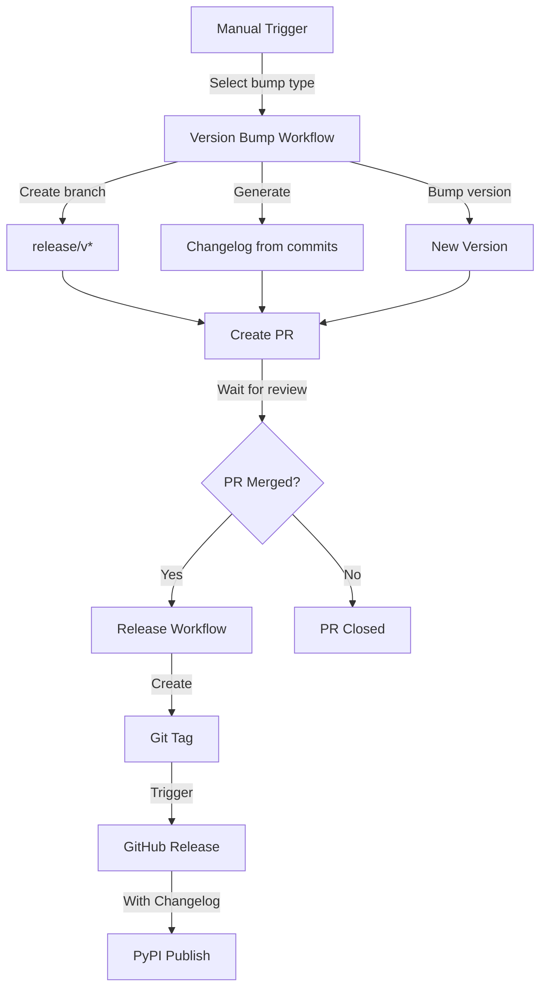

# 🔄 GitHub Workflows

This directory contains the GitHub Actions workflows for automated version management, testing, and publishing.

## 🛠️ Development Tools

This project uses modern Python tooling in its workflows:

- 🏗️ **Hatch**: Used for environment management, building, and publishing
  - Manages virtual environments
  - Handles version bumping
  - Builds and publishes to PyPI
  - Configured in `pyproject.toml`

- 🚀 **UV**: Fast Python package installer
  - Used as the default installer in Hatch
  - Provides faster dependency resolution
  - Configured in `pyproject.toml` with `installer = "uv"`

## 🔄 Version Management Flow



## 📝 Changelog Format

Our changelogs are generated automatically and include:

```markdown
# 🔖 Version Bump: v0.1.0 → v0.2.0

## 📝 Changes

- [Add new feature X](https://github.com/org/repo/commit/a1b2c3d...)
- [Fix critical bug in module Y](https://github.com/org/repo/commit/e4f5g6h...)
- [Update documentation](https://github.com/org/repo/commit/i7j8k9l...)

---
```

## 🔧 Workflow Details

### 🔖 [Version Bump Workflow](version-bump.yml)
- **Trigger**: Manual via GitHub Actions UI
- **Options**: patch, minor, major, rc, beta, alpha
- **Actions**:
  1. Creates a release branch
  2. Bumps version using Hatch
  3. Generates changelog from commits
  4. Creates a PR with:
     - Version bump changes
     - Changelog
     - Release labels

### 🚀 [Release and Publish Workflow](version-publish.yml)
- **Trigger**: Release PR merged to main
- **Actions**:
  1. Creates Git tag
  2. Creates GitHub Release
     - Uses PR description as release notes
     - Tags with version number
     - Marks pre-releases automatically (rc/beta/alpha)
  3. Publishes to PyPI using Hatch

### ✅ [Quality Workflow](quality.yml)
- **Trigger**: Push to main or PR
- **Matrix**: Python 3.8, 3.11, 3.12
- **Actions**:
  1. Code formatting (black, isort)
  2. Linting (flake8, pylint, mypy)
  3. Tests with coverage
  4. Uploads coverage results

## ⚙️ Required Setup

### 🔑 Environment Variables

- `PYPI_TOKEN`: Required for publishing to PyPI
  - Create a token at PyPI with upload permissions
  - Add to repository secrets
- `GITHUB_TOKEN`: Used for PR creation and releases (automatically provided)

### 🏷️ Repository Labels

Create these labels in your repository:
- `release`: Identifies version bump PRs
- `automated pr`: Marks automated PRs

## ❗ Troubleshooting

Common issues and solutions:

1. **Version Bump Fails** 🔖:
   - Check if the version in [`__init__.py`](../src/typer_common_functions/__init__.py) matches PyPI
   - Ensure you have the latest commits

2. **Release Creation Fails** 🚀:
   - Verify branch permissions
   - Check if tag already exists

3. **PyPI Upload Fails** 📦:
   - Verify PYPI_TOKEN permissions
   - Check if version already exists on PyPI

## 📁 Files Overview

- 🔖 [`version-bump.yml`](version-bump.yml): Handles version bumping and PR creation
- 🚀 [`version-publish.yml`](version-publish.yml): Handles release creation and PyPI publishing
- ✅ [`quality.yml`](quality.yml): Runs tests, linting, and formatting checks
